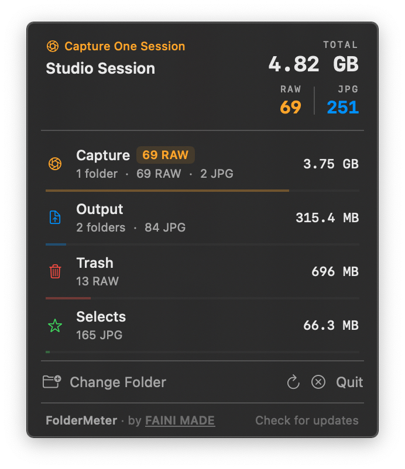

  

<h1 align="center">FolderMeter</h1>

  A lightweight macOS menu bar app that monitors folder sizes in real time. 
  Built for photographers using Capture One — works with any folder.

  
  
  

  

---

## Features

- **Live updates** — file system watcher fires the moment files change, no polling
- **Capture One session detection** — auto-detects Capture / Output / Trash / Selects structure
- **Generic folder mode** — works as a watcher for any folder
- **RAW & JPG counts** — tracks image file types separately across the whole session
- **Per-subfolder breakdown** — size bars, folder counts, file type stats per folder
- **CaptureOne folder excluded** — proxy caches and catalog files don't skew your numbers
- **Persistent** — remembers your folder across launches
- Menu bar only — no dock icon, no ⌘-Tab clutter

---

## Requirements

- macOS 14.0 (Sonoma) or later
- Xcode 15+

## Building

1. Clone the repo
2. Open `FolderMeter.xcodeproj` in Xcode
3. Set your development team in **Signing & Capabilities**
4. Add the entitlement `com.apple.security.files.user-selected.read-only`
5. Set deployment target to **macOS 14.0**
6. Build & Run (`⌘R`)

---

## Capture One Detection

Detects a Capture One session when the watched folder contains a `Capture` subfolder, or both `Output` + `Trash`. Once detected, named rows are shown with context-aware icons:

| Folder | Color | Notes |
|---|---|---|
| Capture | Orange | Shows RAW file count badge |
| Output | Blue | Shows JPG count and subfolder count |
| Trash | Red | |
| Selects | Green | |

The `CaptureOne` system folder (proxies, cache, catalog) is excluded from all file counts and size totals.

## RAW Formats Supported

`CR2 CR3 NEF ARW ORF RW2 DNG RAF 3FR FFF IIQ MRW NRW PEF RWL SR2 SRF X3F ERF RAW`

---

## Support

If you find FolderMeter useful, consider supporting development:

  
  &nbsp;
  
  &nbsp;
  

---

  Made by <a href="https://www.fainimade.com">FAINI MADE</a>
