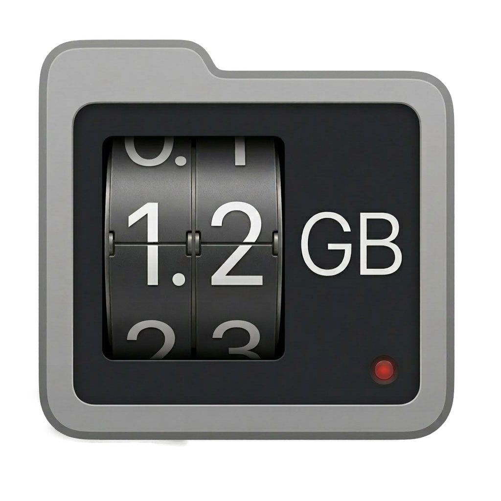

  

<h1 align="center">FolderMeter</h1>

  A lightweight macOS menu bar app that monitors folder sizes in real time. 
  Built for photographers using Capture One — works with any folder.

  
  
  

  

---

## Features

- **Live updates** — file system watcher fires the moment files change, no polling
- **Capture One session detection** — auto-detects Capture / Output / Trash / Selects structure
- **Generic folder mode** — works as a watcher for any folder
- **RAW, JPG & TIFF counts** — tracks image file types separately across the whole session
- **Per-subfolder breakdown** — size bars, folder counts, file type stats per folder
- **CaptureOne folder excluded** — proxy caches and catalog files don't skew your numbers
- **Desktop widget** — small and medium widgets show live session data at a glance
- **Persistent** — remembers your folder across launches
- Menu bar only — no dock icon, no ⌘-Tab clutter

---

## How to Get It

### Download the latest release

The easiest way to get started is to download the pre-built app directly from the [Releases](../../releases/latest) page. No Xcode required.

1. Download `FolderMeter.zip` from the latest release
2. Unzip and move `FolderMeter.app` to your Applications folder
3. Launch it

### First Launch

Since FolderMeter is not distributed through the App Store, macOS may block it on first launch. If that happens:

1. Go to **System Settings → Privacy & Security**
2. Scroll down and click **Open Anyway** next to the FolderMeter message
3. You'll only need to do this once

When you pick a folder for the first time, macOS will ask if FolderMeter can access it. Click **Allow**. That's the only permission it needs — no Full Disk Access required.

### Build from source

Requires macOS 14.0+ and Xcode 15+.

1. Clone the repo
2. Open `FolderMeter.xcodeproj` in Xcode
3. Set your development team in **Signing & Capabilities**
4. Build & Run (`⌘R`)

---

## Widget

FolderMeter includes a desktop widget in two sizes — small and medium — that updates automatically as your session changes.

**Small widget** shows total session size and RAW/JPG/TIFF counts at a glance.

**Medium widget** adds a per-folder breakdown with size bars, mirroring the menu bar view.

### Adding the widget

1. Right-click your desktop and choose **Edit Widgets**
2. Search for **FolderMeter**
3. Drag either the small or medium widget to your desktop

The widget reflects whatever folder you have selected in the menu bar app. Open FolderMeter and select a folder first if you haven't already.

---

## Capture One Detection

Detects a Capture One session when the watched folder contains all four subfolders: `Capture`, `Output`, `Trash`, and `Selects`. Once detected, named rows are shown with context-aware icons:

| Folder | Color | Notes |
|---|---|---|
| Capture | Orange | Shows RAW file count badge |
| Output | Blue | Shows JPG count and subfolder count |
| Trash | Red | |
| Selects | Green | |

The `CaptureOne` system folder (proxies, cache, catalog) is excluded from all file counts and size totals.

## RAW Formats Supported

`CR2 CR3 NEF ARW ORF RW2 DNG RAF 3FR FFF IIQ MRW NRW PEF RWL SR2 SRF X3F ERF RAW`

## License

FolderMeter is licensed under [CC BY-NC 4.0](https://creativecommons.org/licenses/by-nc/4.0/). Free for personal and non-commercial use. For commercial licensing contact [fainimade.com](https://www.fainimade.com).

---

## Support

If you find FolderMeter useful, consider supporting development:

  
  &nbsp;
  
  &nbsp;
  

---

  By <a href="https://www.fainimade.com">FAINI MADE</a>

